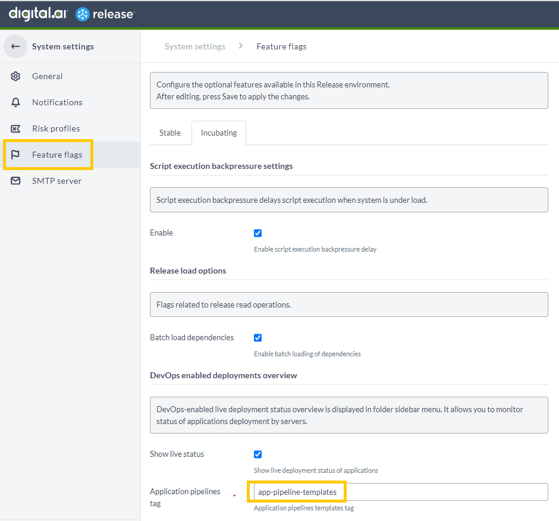
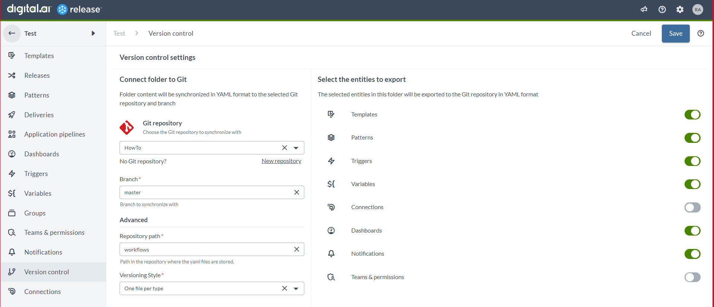
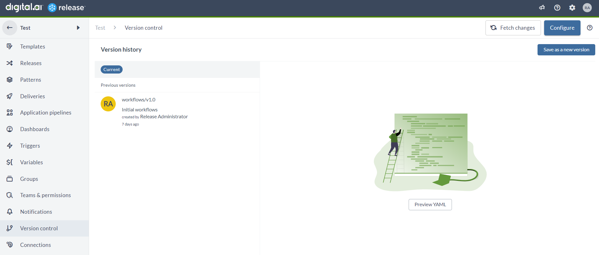
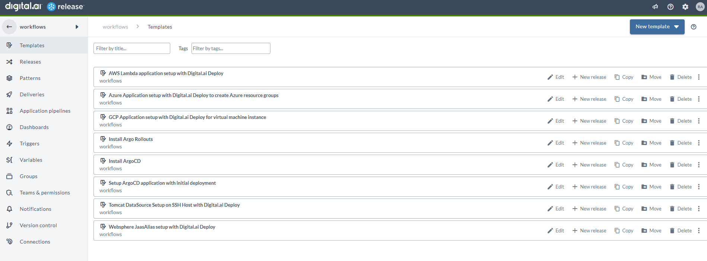
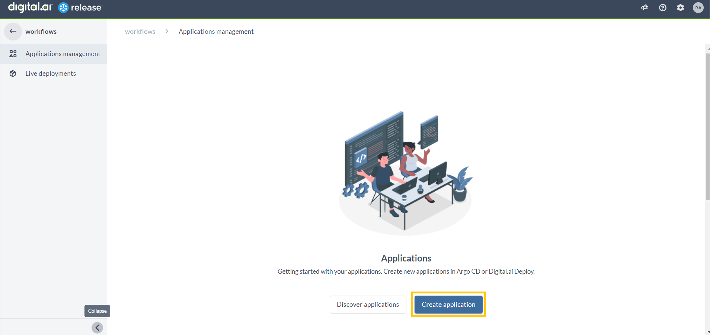
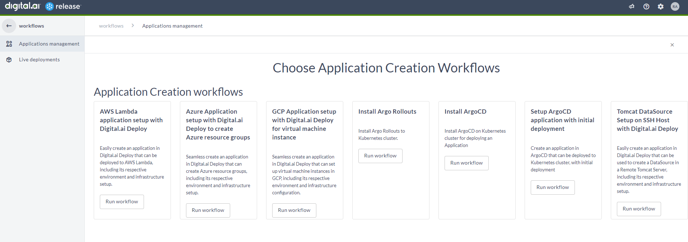
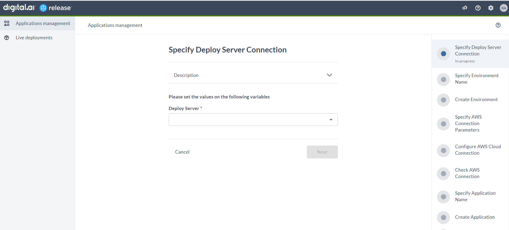
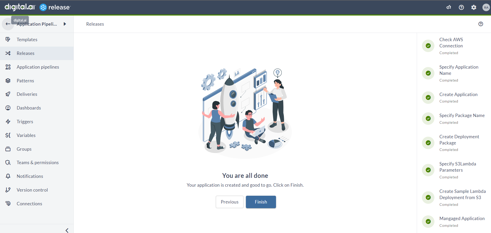
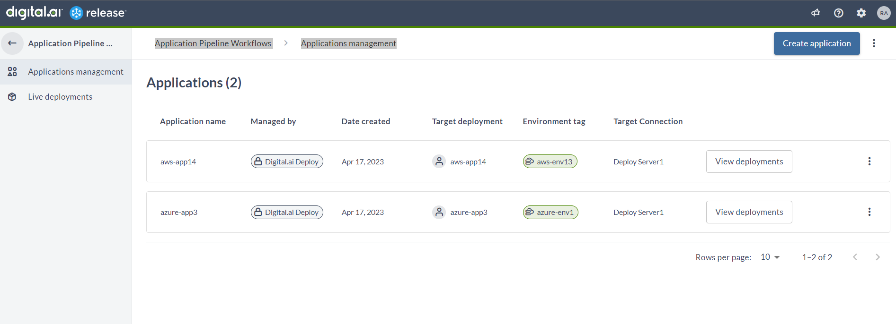

# Release Workflows

Use Release workflows to quickly onboard on Release and Deploy. Use these workflows to interactively setup cloud native and legacy applications in Deploy in no time.

## Prerequisites

1. Digital.ai Release with remote runner setup. [guide](https://github.com/xebialabs/xlr-remote-runner/wiki/)
2. Ensure required plugins are installed.
	1. xlr-xld-remote-integration [image not available in public repository yet]
3. Digital.ai Deploy setup with the plugins as required.
	1. xld-aws-plugin
	2. xld-azure-plugin
	3. xld-google-cloud-compute-plugin
	4. tomcat-plugin
	5. was-plugin
4. Make note of the Application Pipelines Tag under Settings -> System Settings -> Feature Flags -> Incubating.

5. Add this tag to any Release template to run it as a workflow.

## Setting up Workflows

Fork this [repository](https://github.com/digital-ai/howto)

In Digital.ai Release, 
1. Create a new folder.
2. From within the folder, in the left pane, select 'Version control'.
3. Click on Configure button on the top left.
4. Under Git Repository, click on the New Repository link.
5. Create a new connection by specifying the details of the Forked Repository.
6. Specify the branch as master and specify the Repository path as 'workflows' and save.

7. Under the connection Screen, create a connection for the target deploy server under the name Deploy Server1
8. Back in the Version Control screen, select the latest version displayed and click 'Apply this version'.

9. The workflow templates are populated in the Templates section.

### Running Workflows

1. From within the above setup folder, click Application Pipelines and then click Create Application.

2. A number of Application Workflows are listed. 

3. Click on the required application's Run Workflow button.

4. A pipeline like workflow is presented. Specify the details when prompted.
5. Digital.ai Release, takes you through the multiple steps of application creation.
6. When all steps are complete, click Finish 

7.All created applications are listed under, Application Pipeline Workflows -> Applications management

